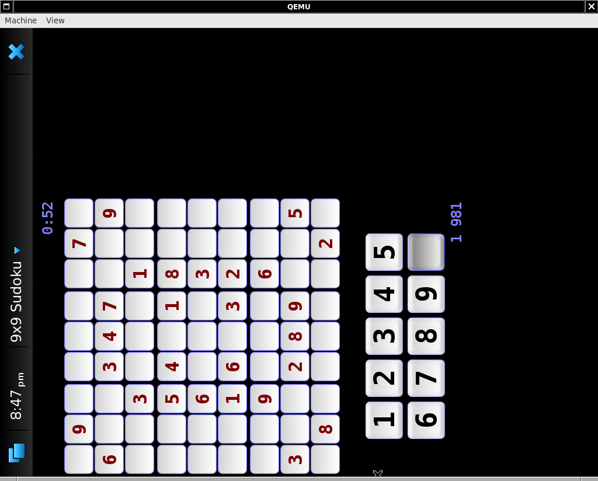

# 9x9 sudoku



### installation

```bash
cmake -Bbuild -DCMAKE_INSTALL_PREFIX=/ .
sudo make -Cbuild -j4 install
```

this installs:

```text
-- Installing: /opt/9x9-sudoku/gui
-- Installing: /opt/9x9-sudoku/game.pl
-- Installing: /opt/9x9-sudoku/pzl1.gz
-- Installing: /opt/9x9-sudoku/pzl2.gz
-- Installing: /opt/9x9-sudoku/pzl3.gz
-- Installing: /opt/9x9-sudoku/pzl4.gz
-- Installing: /opt/9x9-sudoku/pzl5.gz
-- Up-to-date: /usr/share/icons/hicolor/64x64/apps/9x9-sudoku.png
-- Up-to-date: /usr/share/applications/hildon/9x9-sudoku.desktop
-- Up-to-date: /usr/share/dbus-1/services/9x9-sudoku.service
```